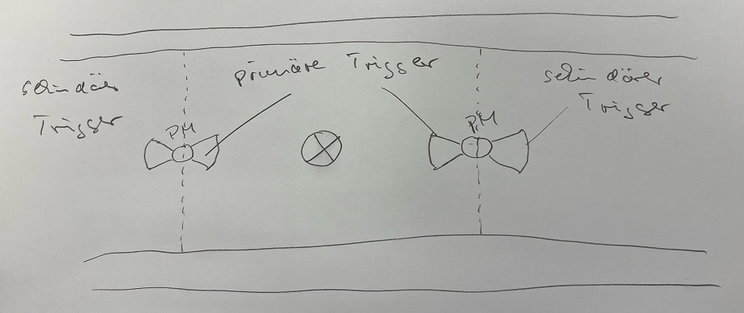

# Light Control

Modul für Symcon ab Version 6.3.

Steuert einen Lichtpunkt nach vorgegebenen Einstellungen.

## Dokumentation

**Inhaltsverzeichnis**

1. [Funktionsumfang](#1-funktionsumfang)  
2. [Voraussetzungen](#2-voraussetzungen)  
3. [Installation](#3-installation)  
4. [Funktionsreferenz](#4-funktionsreferenz)
5. [Konfiguration](#5-konfiguration)  
6. [Statusvariablen und Profile](#6-statusvariablen-und-profile)  
7. [Anhang](#7-anhang)
    1. [GUIDs der Module](#guids-der-modul(e))

## 1. Funktionsumfang

Durch die Vewendung eines an KNX gekoppelten Dali Systems ergaben sich viele einzelnd zu steuernde, dimmbare Lichtpunkte. Da die grundsätzliche Steuerung durch Präsenzmelder (PM) realisiert werden sollte, standen dadurch vielfältige Möglichkeiten einer sehr feinen Ansteuerung der einzelnen Lichtpunkte zur Verfügung. Grundsätzlich sollte zwar soviel Logik wie Möglich in dem autarken KNX System implementiert werden, allerdings schien der Aufwand an Hardware (Logikmodule, Zeitschaltuhren,..) überprpportinal hoch.

Ein herzliches Dankeschön muss ich an dieser Stelle an @bumaas aussprechen, der mit seinem BlindControl Modul nicht nur meine Anforderungen an eine Rolladensteuerung teilweise übertroffen hat, sondern mit dem Code seines Modules auch an vielen Stelle "Pate" stand da es etliche Überschneidungen in den Logikanforderungen gab.

- Schalter zum aktivieren des Automatikmodus
- 1-n Daliaddressen werden geschaltet
- 1-n auslösende PM als "primäre Trigger"
- 1-n auslösende PM als "sekundäre Trigger"
- Zeitschaltung von Nacht auf Morgen.
- Zeitschaltung von Tag auf Abend
- Wenn bereits IstTag auf Tag oder Abend geschaltet hat, 
- Aktionsschaltung von Morgen auf Tag (IstTag)
- Aktionsschaltung von Tag auf Abend (IstTag)
- Ein primärer Trigger dimmt die Lichtpunkte auf die zu dem Zeitpunkt definierte Dimmstufe
- Ein sekundärer Trigger dimmt die Lichtpunkte auf einen reduzierten Wert der zu dem Zeipunkt geltenden Dimmstufe 

Beispiel: Tagsüber soll die reguläre Dimmstärke eines Lichtpunktes 2% betragen. Für die sekundären Trigger ist ein Wert von 20% angegeben. Wird eine Bewegung innerhalb der sekundären Trigger von links oder rechts erkannt, wird der Lichtpunkt auf 20% von den 2% Sollwert gestellt. Das wären in diesem Fall 0,4% der Gesamtleuchtleistung. Da dies in der Regel kein einstellbarer Wert für den Dimmaktor ist, wird der reduzierte Wert immer aufgerundet, so dass dar Leuchtpunkt mit 1% angesteuert wird.
Sobald ein primärer Trigger auslöst wird die Leuchte auf 2% gesetzt.

Die Idee dahinter ist, dass man nie einen komplett unbeleuchteten Bereich betreten soll der erst wenn man sich in Ihm befindet angeschaltet wird.

## 2. Voraussetzungen
IP Symcon 7.0 und später
Der Lichtpunkt muss einen an/aus Schalter haben (boolean)
UND der Lichtpunkt muss ein Dimmobjekt haben (integer 0-100 % )
Die Auslösenden Variablen (Präsenzmelder) sind vom typ boolean

## 3. Installation

Das Modul wird über den Modul Store installiert.

Anlegen einer Lichtinstanz
In Symcon an beliebiger Stelle Instanz hinzufügen auswählen und Light Controller auswählen. Es wird eine Lichtinstanz angelegt, in der die Eigenschaften zur Steuerung eines einzelnen oder mehrerer  Licht(punkt)es gesetzt werden.

## 4. Funktionsreferenz

## 5. Konfiguration

### 5.1 Überprüfen, ob der zu steuernde Lichtpunkt korrekt in IP-Symcon eingerichtet ist

### 5.2 Einrichtung des Wochenplans

### 5.3 Tagerkennung (optional)

#### 5.3.1 Übersteuernde Tagesanfang- und Endezeiten (optional)

### 5.4 Licht nach Helligket (optional)

### 5.5 Erkennung von Kontakten (optional)

### 5.6 Light Controller

## 6. Statusvariablen und Profile

Folgende Statusvariablen werden angelegt:

#####ACTIVATED
Über die Statusvariable kann die automatische Steuerung aktiviert und deaktiviert werden. Beim (Wieder-)Einschalten der automatischen Steuerung werden vorher erkannte manuelle Eingriffe verworfen.
 
#####LAST_MESSAGE
Die Statusvariable beinhaltet einen Hinweis über die letzte Schaltung. Um die Schaltungen eines Lichpunktes zu kontrollieren, bietet es sich an, die Archivierung für diese Variable einzuschalten. 
Dann werden im Webfront die Schaltereignisse in Form eines Logfiles dargestellt.  

## 7. Anhang

###  GUIDs der Module

|           Modul            |  Typ   |                  GUID                  |
|:--------------------------:|:------:|:--------------------------------------:|
|      Light Control         | Device | {610B80D7-5CFE-989E-AD6D-48EDE751ABDD} |
| ...                        | Device | {...                                 } |